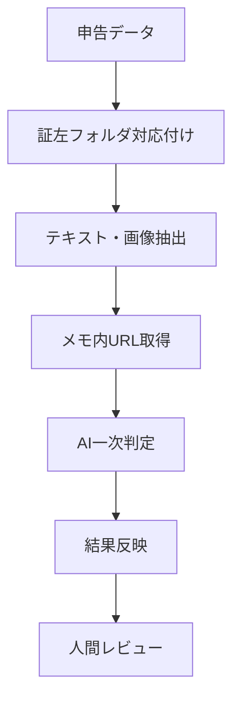
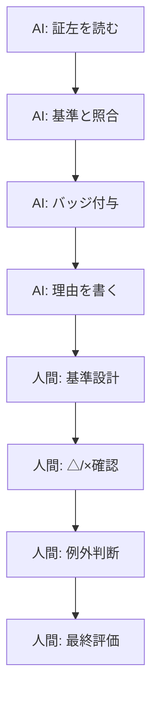

# TL;DR

社内横断でAI活用度を評価するプロジェクトを運営していると、**自己申告の内容を裏付ける「証左」の確認**が重くなります。

数十の対象組織が、十数個の評価項目について自己申告する。さらに高いレベルを申告した項目については、スライド、ドキュメント、スクリーンショット、動画、URLなどの証左を確認する必要がある。**これをすべて人間が精読する運用は、すぐに限界が来ます。**

この記事は、プロジェクト情報をSSOTとして整理してAIが働きやすい状態を作る話の次のステップとして、**整理した評価基準を実行可能な判定パイプラインに載せた実装メモ**です。
https://zenn.dev/yukamiya/articles/pm-ssot-claude-skills

そこで、Google Drive上の資料、申告メモ、メモ内のURL先資料をNode.js製のCLIで集め、マルチモーダルLLMに渡して `◎ / ○ / △ / ×` の4段階で一次判定する仕組みを作りました。

重要なのは、**AIを最終判定者にしないこと**です。この仕組みの目的は「AIに裁かせる」ことではなく、**人間が重点的に見るべき項目を浮かび上がらせること**です。

# 背景: 自己申告だけでは公平性が担保できない

社内のAI活用度評価では、各組織に自分たちの現在地を自己申告してもらう形式を取りました。

自己申告には良い面があります。評価項目を読み、自分たちの取り組みを言語化し、現在地を整理するプロセスそのものが、AI活用を見直す機会になるからです。

一方で、**自己申告だけでは公平性を担保できません。**

たとえば、ある項目で高いレベルを申告している場合、その内容を裏付ける材料が必要です。実際に運用されているワークフローなのか、単発の試行なのか。効果測定までできているのか、体感だけなのか。チーム全体に広がっているのか、一部メンバーの工夫なのか。

こうした差分は、申告値だけでは見えません。

そのため、一定以上の申告に対しては証左を提出してもらい、評価基準と照らし合わせて確認する運用にしました。

ただ、ここで別の問題が出ます。

- 証左の形式がバラバラ
- 評価項目が多い
- 1項目に複数ファイルが置かれる
- スライドや画像の中に重要な情報がある
- 申告メモだけにURLが書かれていることがある
- すべてを人間が読むと、審議前の下読みだけで時間を使い切る

この時点で必要だったのは、完璧な自動判定ではありません。**人間が読むべき箇所を絞る一次スクリーニング**でした。

# 設計方針: AIに裁かせるのではなく、審議を軽くする

最初に決めたのは、**責務の分け方**です。

AIには、証左の内容と評価基準を照合し、申告レベルを裏付けられそうかを一次判定させます。ただし、**最終的な評価や例外判断は人間が行います。**

運用上は、判定結果を次の4段階にしました。

| バッジ | 意味 | 人間の扱い |
| --- | --- | --- |
| `◎` | 申告レベル以上の証左が十分にある | 原則そのまま確認 |
| `○` | 申告レベルに概ね見合う | 軽く確認 |
| `△` | 部分的には確認できるが疑問が残る | 重点確認 |
| `×` | 証左が不足している | 重点確認 |

この設計にすると、AIの役割が明確になります。

**AIは評価者ではなく、レビューキューを作る担当です。** `△` と `×` を優先的に人間が見ることで、全件精読に近い安心感を保ちながら、審議の負荷を下げられます。

もう一つ大事にしたのは、**AIに渡すコンテキストを「判定に必要な材料」に揃えること**です。

単に「この資料を読んで妥当か判断して」と投げると、判断基準が曖昧になります。そこで、プロンプトには必ず以下を含めるようにしました。

- 評価項目のID、名前、説明
- Lv1からLv5までの定義
- 申告されたレベル
- 申告メモ
- 証左フォルダ内のファイル一覧
- 抽出済みテキスト
- 画像や動画キーフレーム
- 判定ルール
- JSONの出力形式

**評価基準、申告内容、証左、出力形式をひとまとまりにして渡す**ことで、AIの判断を運用に組み込みやすくしました。

# 実装: 証左チェックCLIのパイプライン

全体像は次のような流れです。



入力は、各組織の申告データと、証左フォルダの一覧です。CLIは申告データの各項目に対して、対応する証左フォルダを見つけ、ファイルの内容を抽出し、AIに判定を依頼します。

## 1. チェック対象を絞る

すべての項目を毎回AI判定にかけると、コストも時間もかかります。

そのため、基本的には**高めの申告レベルだけをチェック対象**にしつつ、低めの申告でも証左フォルダや具体的なメモがある場合は判定できるようにしました。

簡略化して擬似コードにすると、対象項目の選定とAI判定呼び出しはこのような形です。

```text
MIN_CHECK_LEVEL = 3

function checkItem(item, declaredLevel, memo, evidenceFolder):
  meaningfulMemo = removePreviousAiJudgment(memo).hasContent()

  if declaredLevel < MIN_CHECK_LEVEL:
    if evidenceFolder is missing and meaningfulMemo is false:
      return skip

  if evidenceFolder is missing and meaningfulMemo is false:
    return judgment(
      badge = "×",
      comment = "申告内容を裏付ける証左が見つかりません",
      evidenceFiles = []
    )

  if evidenceFolder exists:
    folderEvidence = extractEvidenceFromFolder(evidenceFolder)
  else:
    folderEvidence = emptyEvidence

  if meaningfulMemo:
    linkedEvidence = fetchEvidenceFromLinksInMemo(memo)
  else:
    linkedEvidence = emptyEvidence

  judgment = askAiToJudge(
    item = item,
    declaredLevel = declaredLevel,
    memo = memo,
    files = folderEvidence.files,
    texts = folderEvidence.texts + linkedEvidence.texts,
    images = folderEvidence.images + linkedEvidence.images
  )

  return judgmentResult(
    badge = judgment.badge,
    comment = judgment.comment,
    evidenceFiles = namesOf(folderEvidence.files),
    checkedAt = currentTime()
  )
```

ここで気をつけたのは、**「証左フォルダがない = 即NG」にしないこと**です。

申告メモに具体的な説明やURLが書かれているケースもあります。そのため、フォルダとメモの両方を証左候補として扱います。

一方で、過去にCLIが書き込んだAI判定行だけがメモに残っている場合、それを証左として再利用してしまうと自己参照になります。そこで、既存のAI判定行は取り除いたうえで、実質的なメモがあるかを判定します。

## 2. 証左をテキストと画像に展開する

証左の形式はかなりばらつきます。

Google Docs、Google Sheets、Google SlidesのようなGoogle Workspaceファイルもあれば、PDF、DOCX、XLSX、PPTX、画像、ZIP、動画もあります。

CLIでは、それぞれを次のように扱いました。

| 種類 | 扱い |
| --- | --- |
| Google Docs | エクスポートしてテキスト抽出 |
| Google Sheets | CSVとして取得 |
| Google Slides | PPTXにエクスポートしてテキストと画像を抽出 |
| PDF | テキスト抽出し、必要に応じてOCRやページ画像化 |
| DOCX/PPTX | テキストと埋め込み画像を抽出 |
| XLSX | シートごとにCSV化 |
| 画像 | OCR対象、または画像としてLLMに渡す |
| ZIP | 中の対応ファイルを再帰的に抽出 |
| 動画 | キーフレームを抽出して画像として渡す |
| メモ内URL | Google WorkspaceやDriveフォルダ、キャッシュ済みURLを取得 |

ポイントは、**テキスト抽出だけに寄せなかったこと**です。

証左にはスクリーンショットやスライドキャプチャが多く含まれます。テキスト化できない情報を落とすと、実際には十分な証左があるのに `△` や `×` になりやすい。そのため、画像もマルチモーダルLLMへ渡す前提にしました。

## 3. 判定プロンプトを固定する

AI判定の肝はプロンプトです。

ここでは、**自由に推論させるのではなく、評価項目ごとのレベル定義と判定ルールを毎回明示します。**

実際のプロンプトはもっと長いですが、構造を擬似的に書くとこのような形です。

```text
Prompt:
  Role:
    あなたは社内AI活用度評価の一次チェック担当です。
    証左の内容を評価指標の定義と照合し、申告レベルの妥当性を判定してください。

  Evaluation item:
    - ID
    - 項目名
    - 項目説明

  Level definitions:
    - Lv1 の定義
    - Lv2 の定義
    - Lv3 の定義
    - Lv4 の定義
    - Lv5 の定義

  Declaration:
    - 申告レベル
    - 申告メモ

  Evidence:
    - 証左ファイル一覧
    - 抽出済みテキスト
    - 添付画像の有無と枚数

  Judgment rules:
    1. 申告レベルの定義と証左の内容を照合する
    2. 判定は「◎」「○」「△」「×」の4段階にする
    3. ファイルが0件でも、申告メモに具体的な証左があれば評価対象にする
    4. 証左が申告レベルを上回っている場合は「◎」にする

  Output:
    JSONのみを返す
    badge: "◎" or "○" or "△" or "×"
    comment: 判定理由を1-3文で簡潔に書く
```

特に効いたのは、判定ルールの4つ目です。

**証左が申告レベルを大きく上回っている場合、これは「不整合」ではなく「十分以上に裏付けられている」状態です。** このルールを書かないと、申告レベルと証左レベルがぴったり一致しないことを悪く見てしまう可能性があります。

## 4. LLM API呼び出しは薄いアダプタに閉じ込める

LLM APIを呼ぶ部分は、できるだけ薄いアダプタとして切り出しました。

ここでやることはシンプルです。モデルID、最大出力トークン数、テキストプロンプト、画像を受け取り、LLMに問い合わせて、返ってきたテキストを後続のパーサーに渡します。

擬似コードにすると、この程度の責務です。

```text
function askAiToJudge(prompt, images, options):
  model = options.model or defaultMultimodalModel

  request = createLlmRequest(
    model = model,
    maxOutputTokens = options.maxOutputTokens,
    contents = [
      text(prompt),
      each image in images as imageContent
    ]
  )

  response = callLlmApi(request)

  if api call failed:
    return rawJudgmentResponse(
      status = "failed",
      text = errorMessage
    )

  return rawJudgmentResponse(
    status = "ok",
    text = response.text
  )
```

ポイントは、**プロバイダー固有のAPI仕様を判定ロジックに混ぜないこと**です。

証左抽出、プロンプト構築、LLM呼び出し、レスポンス解析を分けておくと、モデルを差し替えたい場合や、タイムアウト・レート制限・リトライを調整したい場合に影響範囲を小さくできます。

また、マルチモーダル判定ではテキストだけでなく画像も渡すため、アダプタの入力は最初から `prompt + images` の形にしています。これにより、PDFページ画像、スライド内画像、動画キーフレームを同じ扱いでLLMへ渡せます。

## 5. 出力はJSONに固定し、失敗時は人間確認へ倒す

LLMの出力は、運用に載せるなら構造化して扱いたいです。

そこで、出力は必ずJSONに固定しました。ただし、実際にはコードブロック付きで返ってきたり、前後に説明文が混ざったり、不正なバッジが返ってくる可能性があります。

そのため、パーサー側では、読めないものは `△`、つまり**人間確認へ倒す**方針にしました。

```text
function parseJudgmentResponse(responseText):
  json = extractJsonObject(responseText)

  if json is not found:
    return judgment(
      badge = "△",
      comment = "AI応答を解析できないため、人間による確認が必要"
    )

  if json cannot be parsed:
    return judgment(
      badge = "△",
      comment = "JSONを解析できないため、人間による確認が必要"
    )

  if json.badge is not one of ["◎", "○", "△", "×"]:
    return judgment(
      badge = "△",
      comment = "不正な判定値のため、人間による確認が必要"
    )

  return judgment(
    badge = json.badge,
    comment = json.comment
  )
```

ここで **`×` にしない**のがポイントです。

パースできなかったことと、証左が不足していることは別です。システム側の失敗やLLM出力の揺れは、証左不足ではなく「要確認」として扱うべきです。

# AIと人間の責務分担

この仕組みは**Human-in-the-loopを前提**にしています。



AIが得意なのは、大量の資料を一定の基準で読み、怪しいものを浮かび上がらせることです。

一方で、**評価基準そのものの設計、組織ごとの事情、例外処理、最終判断は人間が担うべきです。** ここを混ぜると、AIの判定が独り歩きします。

そのため、CLIの出力も、**最終評価ではなく一次チェック結果として扱います。**

# 運用して効いたこと

実際に運用してみて、効いたのは大きく3つです。

## 全件精読から、重点確認へ移れる

人間が最初から全証左を読むのではなく、**AIが付けた `△` と `×` を優先して確認**できます。

もちろん、`◎` や `○` をまったく見ないわけではありません。ただ、最初に見るべき対象が絞られるだけで、審議前の負荷はかなり変わります。

## 再実行しやすい

証左確認は一度で終わりません。

提出漏れが見つかる、メモが追記される、抽出に失敗したファイルが直る、判定基準を微修正する。こうしたことが普通に起きます。

そのため、CLIには次のような運用オプションを持たせました。

- APIを呼ばずに構造だけ確認するdry-run
- 既に判定済みの項目をスキップするオプション
- 判定結果を申告メモへ追記するオプション
- 特定の対象だけを絞り込んで実行するオプション

この手の運用CLIは、**初回実行より再実行のしやすさが大事**です。

## 過去のAI判定を証左として扱わない

再実行時に地味に重要だったのが、過去のAI判定行の扱いです。

メモ欄に前回のAI判定結果が残っている場合、それをそのまま証左として読ませると、**AIが過去のAI判定を根拠にしてしまいます。**

これは避けたいので、メモを証左として扱う前に、既存のAI判定行や証左フォルダ案内行を取り除くようにしました。

こういう細かいノイズ処理を入れておくと、再実行時の挙動が安定します。

# 作ってみて分かったこと

この仕組みを作ってみて感じたのは、AIを業務に入れるときの難しさは、**モデルの呼び出しよりも周辺の設計にある**ということです。

具体的には、次のような部分です。

- どこまでをAIに任せるか
- 何をコンテキストとして渡すか
- 失敗時にどちらへ倒すか
- 再実行時にノイズを増やさないか
- 人間が最終判断しやすい出力になっているか

LLM APIを呼ぶコード自体は短いです。むしろ重要なのは、**評価基準、証左、判定結果、人間レビューをつなぐハーネスの設計**でした。

前段として評価基準や運用ルールをSSOTとして整理しておくと、こうしたCLIは作りやすくなります。整理された基準があるからこそ、AIに毎回同じ判断材料を渡せるし、出力も運用に組み込めます。

# まとめ

AIによる証左判定機構の本質は、**AIに最終評価を任せることではありません。**

本質は、**人間が判断すべき箇所を浮かび上がらせること**です。

社内横断の評価プロジェクトでは、評価基準、申告内容、証左、審議という複数の要素が絡みます。この複雑さをそのまま人間の読み込み負荷にするのではなく、CLIとLLMで一次整理する。

その結果、人間は「全部読む人」ではなく、**基準を設計し、例外を判断し、最終責任を持つ役割**に集中できます。

AIを業務に組み込むうえで大事なのは、AIに判断を丸投げすることではなく、**人間の判断がより良くなる形に仕事を再設計すること**だと思っています。
