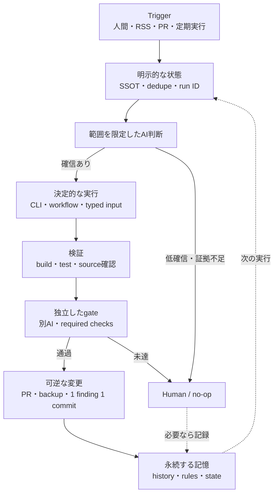

# 最初に見つかったのは、AIの間違った事後分析だった

この1年ほど、3つの個人リポジトリでClaude CodeやCodexに作業を任せてきました。

- ポッドキャストサイトの [`momit.fm`](https://github.com/fuzzy31u/momit.fm)
- ポッドキャストを記事化する [`hub.momit.fm`](https://github.com/fuzzy31u/hub.momit.fm)
- 自分の活動履歴を載せる [`yukamiya.me`](https://github.com/fuzzy31u/yukamiya.me)

定期実行、複数エージェント、Skills、ブラウザ操作、自動レビュー。思いつくたびに足した結果、私自身も「何がどこまで自律的に動くのか」を説明できなくなり、3リポジトリのコミットとClaudeセッションを読み直しました。

最初に見つけたのは、**AIが書いた障害原因の間違い**でした。

2026年8月9日、`momit.fm` のVercel buildが `target: es5` で止まり、AIは `es2017` へ変更して復旧させました（`91951ec`）。ところがコミット本文とセッションは、原因を「DependabotがTypeScript 7.0.2を自動マージしたため」と説明しています。

Git graphでは、TypeScript 7の更新 `65eecfa` はDependabot branchにしかなく、`main` の祖先ではありません。障害時の依存はTypeScript 6.0.3。`target=ES5` を拒否した `TS5107` が「TypeScript 7.0では機能しなくなる」と説明しており、AIはopenのDependabot branchと誤って結び付けたようです。

コードは直った。でも、postmortemは間違っていた。

AIに実行を任せるなら、AIが残す説明も監査対象です。詳しいログと正しい因果関係は別物でした。

# コミットとセッションログを突き合わせた

調査では4種類の記録を照合しました。

- Gitのcommit、tree、diff、branchの到達関係
- `CLAUDE.md`、`AGENTS.md`、Skills、Hooks、GitHub Actions
- リポジトリ内に保存されたmanifest、state、運用memory
- Claudeセッションに残った判断、失敗、外部サービスの応答

コミット本文だけではデプロイ成功を証明できません。GitHub上のマージがセッションにしか残っていなければ「セッションログ上」と書く。秘密値、認証URL、セッションID、ローカルパスは記事に持ち込みません。

最初から自律システムを設計したわけではありません。動かす。事故る。状態や停止条件を足す。その繰り返しでした。

# 第1段階: まず、イベントに反応させた

3つの中で最初に定期実行ループが入ったのは `momit.fm` でした。

2025年7月31日の `c7538c4` で、Art19のRSS全体を1時間ごとに取得し、SHA-256が変わったらhashを `main` にコミットしてVercelを起動するGitHub Actionsを追加しています。8月2日の `3ebb8dc` で告知生成を接続し、8月14日の `acf7f8c` で実行間隔を日次へ変えました。

RSSのどんな変更でも発火し得るうえ、hashはPRを通らず `main` へ入ります。それでも、外部イベントから処理が始まる最初の一歩でした。

2026年3月28日には、約2分間の3コミットで構造が変わります。

- `dd2cebd`: タイトルやshownoteの作法をstyle guideへ保存
- `0029c4c`: 文字起こし変換、chapter、入稿用bundle、告知を工程別commandへ分割
- `1d55d0c`: それらを順番に呼ぶ `release-episode` を追加

人間が覚えていた手順を、リファレンス、工程別操作、全体オーケストレーターへ移しました。当初は `.claude/commands/` で、5月20日の `0949408` と `4ecb80f` でSkills形式と参照関係を整えています。

同日の `f43cfca` では、stageとcommit提案だけだったrelease後の手順を、feature branch、PR、Vercel check、diff確認、mergeまで進める流れへ変更。`main` への直接push禁止も明文化しました。

# 第2段階: 作業を分け、途中経過を見えるようにした

`hub.momit.fm` は、2026年2月14日の `f1666a1` で記事生成をGoogle ADKの5役へ分けるところから始まりました。

```text
TranscriptLoader
  → EpisodeMiner
  → DraftWriter
  → ImageGenerator
  → Publisher
```

5体が相談する仕組みではなく、共有stateを渡す直列パイプラインです。toolがstateを直接更新する役にADKの `output_key` を付けると、その値をエージェントの返答で上書きする罠もありました。

同日の `4a30428` で50,000字の入力上限、I/O例外、各段階の経過ログを追加。`ab59a24` では入力がstateにない場合のsample fallbackも入れました。止まりにくい反面、入力失敗を隠して別内容の記事を作り得る設計です。

翌日の `ecf3170` で5段階の進捗をUIに表示。`b86965c` はaffiliate候補のschemaとプレースホルダーlinkをopt-in・既定OFFでpromptへ入れましたが、実serviceとの統合ではありません。`2135086` ではADKをversion固定しました。

5月21日の `60f35a8` では、SEO、Gutenberg形式、広告表記、関連episode、affiliate handoffを `.claude/skills/momithub/SKILL.md` へ保存。仕事の型をversion管理し始めました。

# 第3段階: 判断するAIと、書き込むコードを分けた

`hub.momit.fm` のaffiliate運用には、ブラウザだけの操作とAPI処理が混在します。全部をひとつのエージェントに持たせると、再実行と検証が難しくなります。

2026年7月24日の `0848462` は、運用を次の4役に分けました。

- ISSUE: 商品候補とリンク発行を扱う
- EMBED: 記事へリンクboxを挿入する
- REPORT: 成果を集計する
- HEALTHCHECK: リンク切れを調べる

4役は常駐Agentではありません。Skillが段取りを持ち、決定的処理は `python -m affiliate.cli` に閉じ込めます。記事別manifestをflow間で共有し、dry-runでは変更しない。同じIDは二重挿入せず、実書き込みには `--apply` が必要で、POST前にbackupします。

AIは対象商品を考え、コードは固定配置、重複防止、明示的な書き込み、backupを守る。個別の配置判断までCLI化したわけではありません。

翌日の `c6d8728` は、ArticleBundle APIのtoken未設定を503、誤tokenを401に変更。それまでの既知tokenへのfallbackを削除しました。対象は単一endpointで、アプリ全体の認証ではありません。調査時点ではaffiliate関連とこの修正はfeature branch上です。

# 第4段階: 外界を探すAIに、記憶を持たせた

`yukamiya.me` では、2025年12月27日の `35ff081` でClaude botが活動履歴をMarkdownへ追加しました。しかし活動履歴の表示データは `about-content.js`。翌日の `1831d76` でJSへの同期が必要になり、`546a290` で更新先をルール化しました。

2026年1月12日の `9ebf141` では、活動履歴の正本として不要なMarkdown依存と旧templateを削除し、JSだけを正本にしました。注意書きより先に、間違えようのない構造へ変えています。

1月3日の `5cfde37` は、登壇や掲載を追加するIssue Formを導入。年、月、日英タイトル、URL、役割を項目に分け、Claudeへ渡る入口を整えました。

その後は、新しい公開活動を探し、canonical URL、author metadata、byline、日付を確認してAboutへ追加するルーチンが育ちます。同じURLは再登録せず、曖昧なら見送る。

当初は1時間ごとに回しましたが、11回連続で新規なし。検索枠だけを消費するため週次へ落としました。検索要約が別著者の記事を私の執筆だと誤認した例は、metadataとbylineで棄却し、`rejected_candidates` へ保存しています。

2026年8月13日の `dbcfd03` では、ローカルにあった自動化状態をrepo内へ移しました。`state.json` に検索日時、既知activity、棄却候補を持ち、`memory.md` に環境差を残す。`8f4ef49` では同じURLのQA誤検知を増殖させず、`recurrences` へ畳みました。

同日の `0548c60` は、18件検索して新規0件のstate-only commitです。WebFetchとcurlで試した外部hostへの接続が403となり、2つのauthor pageを取得できなかったため、`last_checked_at` は据え置き。検索要約だけでは採用しない方針も記録しました。このrunに新規候補はありません。何もしなかった理由まで履歴に残しています。

# 3つのリポジトリで観測した現在地

同じ「自律AI」でも、3つは別の問題を解いています。表には調査時点の未merge branch上の実験も含みます。成熟度の順位ではなく、不可逆性と証拠の取り方に応じた3つの回答です。

| リポジトリ | 今の役割 | 明示している状態 | 主な停止点・ガードレール |
| --- | --- | --- | --- |
| `momit.fm` | 人間協調の制作コンベア | RSS hash、transcript、Art19 RSS（公開episode） | 工程確認、Art19はDraft-first、全check成功かつGreptile 5/5の場合のみ障害修正をmerge |
| `hub.momit.fm` | feature branch上の運用・レビュー実験 | ADK state、記事別manifest、review history | dry-run、`--apply`、backup、冪等key、worktree、confidence gate |
| `yukamiya.me` | 記憶を持つ探索・保守ルーチン | canonical URL、検索時刻、棄却候補、再発履歴 | 出典照合、重複排除、低確信ではサイトを変えず保留理由を記録 |

`momit.fm` で公開・予約判断を人間に残しているのは、間違えたときに戻しにくいからです。Episode 100の音源uploadは、約16MBがtoolの10MB上限を超えるという技術制約でも手動になりました。対して、検索候補を棄却するだけなら副作用は小さい。操作ごとに証拠と停止点を変えています。

# 共通していたのは、AIの自由を減らす構造だった

3つを重ねると、同じ部品が何度も現れました。次はその合成図で、各リポジトリがすべての要素を持つわけではありません。



モデルに長い権限を渡したから、自律的に動けるようになったのではありませんでした。

状態をファイルに出す。二重実行を止める。AIの判断後に小さなexecutorを置く。書き込み前にdry-runする。別の検証器を通す。失敗したら戻せる単位でcommitする。次回に必要な事実だけをmemoryへ残す。

AIの周囲にこうした制約を増やした結果、途中を見張らなくてもよい範囲が広がりました。私がこの1年でやっていたハーネスエンジニアリングは、AIを自由にする仕事というより、**AIが迷ってよい範囲をコードで狭める仕事**だったようです。

# レビューAI自身が0/5を取った

この構造がもっとも露骨に出たのが、`hub.momit.fm` のPR review loopです。

2026年8月8日の `4a72b42` は、3観点の並列reviewと、「所見は誤り」と仮定する懐疑役を定義しました。confidence 80以上だけを採用し、detached worktreeで1 findingずつcommit。修正前後のfailing test集合が悪化していない場合だけpushします。

後続の `26f8c29` と `4ba1a32` から、review、修正、履歴記録までは実運用を確認できました。reaction、reply、revertから次のruleを学ぶ最後の輪は未実証です。

このskill自身をGreptileにかけると、Claudeセッションに保存された出力では0/5。branch名の扱い、fork PRのpush先、遅いfeedbackの取りこぼしを指摘されました。

同じセッションログでは、修正後は3/5。さらに直して5/5になりました。それでも自動mergeされませんでした。

初版gateは新しいreview objectを待っていましたが、Greptileは既存summaryをin-place更新。5/5でもobjectが現れず、workflowは12分後にmergeをskipしました。

8月11日の `2337fe3` でreview objectと更新済みsummaryの両方を検知し、待機も15分へ変更。セッションログ上は次のrunでPR #8が自動mergeされましたが、ローカルGitには未取得です。初回の再review起動や方針決定には人間も入りました。

評価器の出力形式、更新方法、遅延までハーネスの一部です。ハーネス自身もレビューされ、直されます。

# 失敗を、次の実行条件へ変える

ログを時系列で読むと、役に立ったのは「AIが一度で正解した話」より、失敗を次回の入力へ変えた箇所でした。

`momit.fm` のArt19操作では、ログインと約16MBの音源uploadを人間へ戻しています。Start Dateを入れて保存するとDraftではなくScheduledになる、音源なしでは日時を保存できない、画面上のSaveが反応しない場合はrequestとAPI応答で永続化を確認する。Episode 100の実操作で踏んだUI固有の罠を、2026年8月9日の `1f373ce` で `upload-art19` Skillとbrowser recipeへ戻しました。

同じ日にVercelを復旧した後、別系統の告知生成GitHub Actionsも落ちていると分かりました。PlaywrightはNode 20以上を要求していたため、workflowをNode 18から22へ更新しています（`8572ee6`）。一つの修正で監視を終えず、関連する実行結果まで追ったことで次の障害を拾えました。

`yukamiya.me` では、GitHub Actions上のQAが一部の日本サイトを到達不能と報告した一方、同じURLは通常回線から複数回200となり、実内容と `og:url` も確認できました。今は同じcanonical URLの再発を `recurrences` にまとめ、環境差としてmemoryへ保存しています。外部fetchが使えなかったrunでは、未確認のsourceを「確認済み」に進めませんでした。

ただし、古いハーネスも残っています。AboutのMarkdownは2026年1月に削除済みなのに、現在のQA Skillとpost-deploy workflowはまだ `src/content/pages/about.md` を比較対象にしています。アプリのSSOTを直しても、ハーネス側が追随するとは限らない。運用コードにもdrift testが要ります。

# 人間を消したわけではない

現在も、次の作業は人間の境界に残しています。

- ログイン、2FA、CAPTCHA、認証情報の入力
- 大きな音源のuploadと、公開・予約の最終判断
- 商品の妥当性や広告量など、正解を機械的に固定しにくい選択
- 出典が曖昧な活動履歴の採否
- 低いreview score、設計変更、既存データとの衝突

逆に、機械へ寄せたのは、重複確認、schema validation、文字起こし変換、build、test、差分比較、backup、状態更新です。人間とAIの分担を「創造的か定型的か」だけで切るより、失敗時の可逆性と、正しさを検証できる証拠の有無で切った方が運用しやすいと感じています。

未解決も多いです。`momit.fm` のRSS hash更新と告知workflowは今も `main` へ直接commitし、release branchと競合することがあります。credential検査のpre-commit hookは警告で、強制blockではありません。単体testが薄いリポジトリもある。Claudeのセッション記録では、`hub.momit.fm` のlaunchdによる週次実行はmacOSのTCC権限制約で失敗し、セッション内loopへ逃がした時期がありました。それもterminalの寿命に依存します。外部review botが止まれば、merge gateも止まります。

自律化が完成した、とはまだ言えません。ただ、どこまで任せ、どこで止めるかは以前より説明できるようになりました。

# 自分用に残した6つの原則

最後に、3リポジトリから共通して残った原則をまとめます。

## 1. 状態を会話の外へ出す

RSS hash、manifest、canonical URL、run ID、棄却候補。次回に必要な事実は、セッション外のversion管理できるstateへ出します。

## 2. AIの判断と副作用を分ける

候補選定はAIに任せても、書き込みは小さなCLIへ寄せる。executorは冪等key、対象branch、許可された操作だけを見ます。

## 3. 不可逆な操作の直前ほど、機械的なgateを置く

push、merge、公開の直前を厳しくする。build、test、source照合、外部reviewerを組み合わせつつ、最後はGitの一次記録へ戻ります。

## 4. 戻せる単位を小さくする

Draft-first、backup、worktree、PR、1 finding 1 commit。可逆性は事故対策であり、判断を後から評価するラベルでもあります。

## 5. no-opと棄却も記録する

新規0件、証拠不足、誤検知も残す。`yukamiya.me` のstate-only commitは、18検索してサイトを更新しなかった理由を監査できる記録です。

## 6. ハーネスもproduct codeとして扱う

Skillの参照先は古くなり、外部AIは出力を変え、schedulerは止まる。ハーネス自身にもlint、fixture、drift検知、reviewが要ります。

# まとめ

コミットログを掘る前、私は「AIがかなり自律的に動くようになった」とぼんやり捉えていました。掘り終えてみると、増えていたのはAIの自由ではありませんでした。

状態ファイル、schema、dry-run、backup、worktree、PR、review marker、外部gate、棄却履歴。AIを囲むコードばかりです。

でも、その囲いがあるから任せられる。失敗しても戻せて、何を根拠に動いたかを後から追えて、確信がなければ何もしない。私が作りたかった自律性は、勝手に走り続けることではなく、**自分で進み、自分で止まり、その理由を残せること**だったのだと思います。

この仕組みはまだ育ちかけです。次にやるなら、3リポジトリに散ったstate、gate、no-op記録の型を共通templateへ切り出し、ハーネスのdriftそのものを検査する仕組みを作りたい。たぶん、また失敗してから必要な形が見えてくるはずです。
